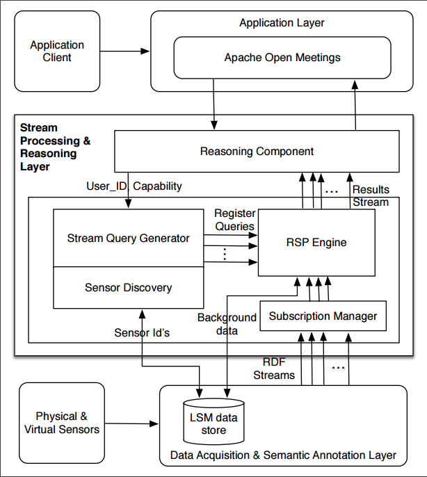

## Linked Data Quality Assessment Service

Nowadays a substantial number of linked datasets are hosted at the different linked data servers and made available for public access. These linked datasets are accessible through SPARQL query and often referred as public SPARQL endpoints, which are freely available to general public. However, a wide adoption of public SPARQL endpoints is hindered by a number of challenges. Data quality, reliability, and quality of service are among the prominent challenges. Different monitoring services have been proposed to monitor and evaluate the quality of service features of public SPARQL endpoints. However, in order to evaluate data quality of any dataset a deep understanding of the internal structure of the data and domain specific knowledge is required.

In this paper, we propose a domain agnostic and query driven approach to monitor, assess and analyze linked data quality of public SPARQL endpoints. We identified various quality related metrics for linked datasets and designed a linked data model to represent these quality related metrics. We provide a Linked Data Quality (LDQ) dataset, which is generated after conducting various quality related tests over few public SPARQL endpoints. Our main goal in this paper is to provide a platform for monitoring, assessing and analysing linked data quality. Data consumers can execute various analytical queries over LDQ to analyse quality related metrics of public SPARQL endpoints. LDQ will increase data consumer's confidence over Public SPARQL endpoints and will support the wide adoption of these datasets in various linked data applications.

### Architecture

